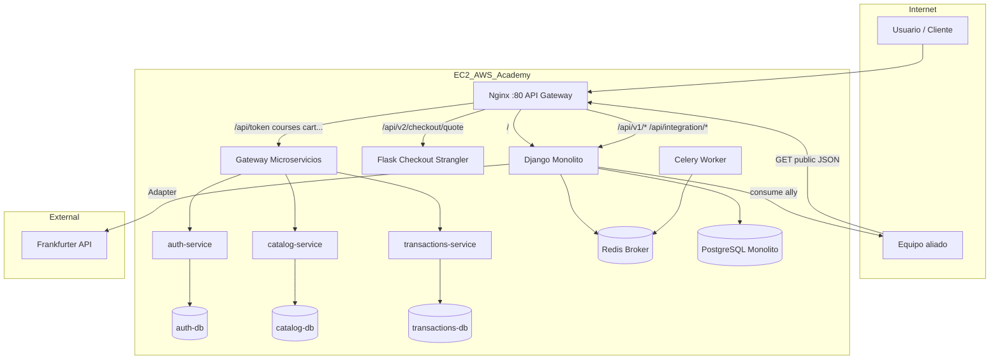

# Wiki — Entregable 2: Microservicios, integración y resiliencia

## 1. Objetivo

Evolución del monolito Django hacia un **ecosistema híbrido** con:

- **Strangler Pattern** (cotización checkout en Flask).
- **Microservicios Flask** (`microservices/`) detrás de **Nginx**.
- **Integración** proveedor / consumidor / API terceros (Adapter).
- **Celery + Redis** para procesos en background.
- **i18n** bilingüe (en/es) con gettext.

## 2. Diagrama de arquitectura (AWS)



## 3. Matriz Strangler + microservicios

| Ruta | Destino | Patrón |
|------|---------|--------|
| `/`, `/courses/`, `/cart/` | Django | Monolito UI |
| `/api/v1/checkout/quote/` | Django | Legacy v1 |
| `/api/v2/checkout/quote` | Flask checkout | **Strangler** |
| `/api/token`, `/api/courses`, `/api/cart`, … | Gateway → MS | **Migración >70% API** |
| `/api/integration/skillforge/public/` | Django | **Servicio a proveer** |
| `/integration/hub/` | Django | **Consumo aliado + UI** |

## 4. Integración (30% rúbrica)

### Servicio a proveer

`GET /api/integration/skillforge/public/` — JSON con estadísticas del sistema (cursos, usuarios, órdenes). Sin autenticación.

### Servicio a consumir

Variable `ALLY_SERVICE_URL` apunta al equipo aliado. El cliente HTTP consume su endpoint público (mismo contrato JSON) y lo muestra en `/integration/hub/`.

### API de terceros (Adapter)

- **Abstracción:** `ExchangeRateProvider` (`core/integration/adapters/base.py`).
- **Implementación:** `FrankfurterExchangeRateAdapter` (API Frankfurter).
- **Endpoint:** `GET /api/integration/exchange-rate/?base=USD&target=COP`.

## 5. Comunicación asíncrona

- **Broker:** Redis (`CELERY_BROKER_URL`).
- **Worker:** `celery_worker` en Docker Compose.
- **Tareas:** `enviar_notificacion_orden_async`, `generar_reporte_actividad_async` (disparadas al confirmar pago).

## 6. i18n y UX

- `LocaleMiddleware`, ``, conmutador EN/ES en navbar.
- Traducciones en `locale/es/LC_MESSAGES/django.po`.
- Hub de integración y navegación con etiquetas traducibles.

## 7. Despliegue

Ver **[DESPLIEGUE_AWS.md](DESPLIEGUE_AWS.md)**.

Comando:

```bash
docker compose up -d --build
```

## 8. Evidencias rápidas

| Evidencia | Comando / URL |
|-----------|----------------|
| Gateway + MS | `curl http://<IP>/api/token` + JWT |
| Strangler | `POST /api/v2/checkout/quote` |
| Proveedor | `GET /api/integration/skillforge/public/` |
| Consumidor | `/integration/hub/` |
| Adapter | `GET /api/integration/exchange-rate/` |
| Celery | `docker compose logs celery_worker` tras checkout |
