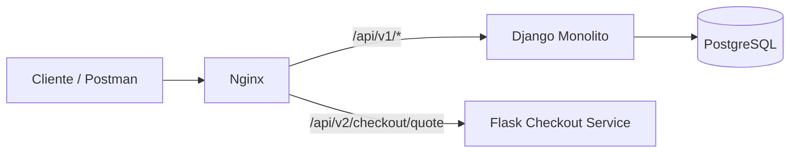

# Migración a Microservicios (Strangler Pattern)

## Módulo estrangulado

**Cotización de checkout** (cálculo de subtotal, descuentos y total de compra).

## Matriz de decisión

| Módulo | Frecuencia de cambio | Consumo de recursos | Acoplamiento | Decisión |
|---|---|---|---|---|
| Autenticación JWT | Media | Baja | Alto (usuarios/sesión) | Mantener en Django |
| Catálogo de cursos | Media | Media | Alto (modelos y vistas) | Mantener en Django |
| Cotización de checkout | Alta (reglas comerciales) | Media/Alta (promociones, validaciones) | Medio | **Estrangular a Flask** |

## Justificación técnica

La cotización de checkout cambia con frecuencia por campañas, cupones y reglas comerciales.  
Mover esta capacidad a un microservicio Flask desacopla la evolución de la lógica de precios del resto del monolito, reduce riesgo de regresiones en otras áreas y habilita despliegues más rápidos de cambios de negocio.

## Solución arquitectónica

- Se mantiene el monolito Django como sistema principal (**v1**).
- Se crea un microservicio Flask para la cotización (**v2**).
- Nginx realiza el ruteo por versión de API:
  - `/api/v1/*` -> Django
  - `/api/v2/checkout/quote` -> Flask

### Snippet de Nginx

```nginx
upstream django_v1 {
    server web_django:8000;
}

upstream flask_v2 {
    server checkout_flask:5000;
}

server {
    listen 80;

    location /api/v1/ {
        proxy_pass http://django_v1;
    }

    location /api/v2/checkout/quote {
        proxy_pass http://flask_v2;
    }
}
```

## Endpoints de evidencia

- `GET /api/v1/checkout/quote/` (Django, requiere autenticación)
- `POST /api/v2/checkout/quote` (Flask, JSON nativo)

### Ejemplo request v2 (Flask)

```json
{
  "items": [
    { "quantity": 1, "unit_price": 120000 },
    { "quantity": 2, "unit_price": 80000 }
  ],
  "coupon_code": "WELCOME10"
}
```

### Ejemplo response v2 (Flask)

```json
{
  "version": "v2",
  "engine": "flask-microservice",
  "items_count": 2,
  "subtotal": 280000.0,
  "discounts": 28000.0,
  "total": 252000.0,
  "currency": "COP"
}
```

## Manejo de errores y resiliencia

El microservicio Flask responde errores estructurados:

- `400 BAD_REQUEST` cuando el payload es inválido.
- `500 INTERNAL_ERROR` para errores no controlados.

Formato:

```json
{
  "error": {
    "code": "BAD_REQUEST",
    "message": "Field 'items' must be a non-empty array."
  }
}
```

## Diagrama (Mermaid)



## Despliegue local

```bash
docker compose up -d --build
```

## Impacto esperado

- Menor riesgo al cambiar reglas de cotización.
- Mayor velocidad de iteración en checkout.
- Base para migrar gradualmente otras funciones críticas.
